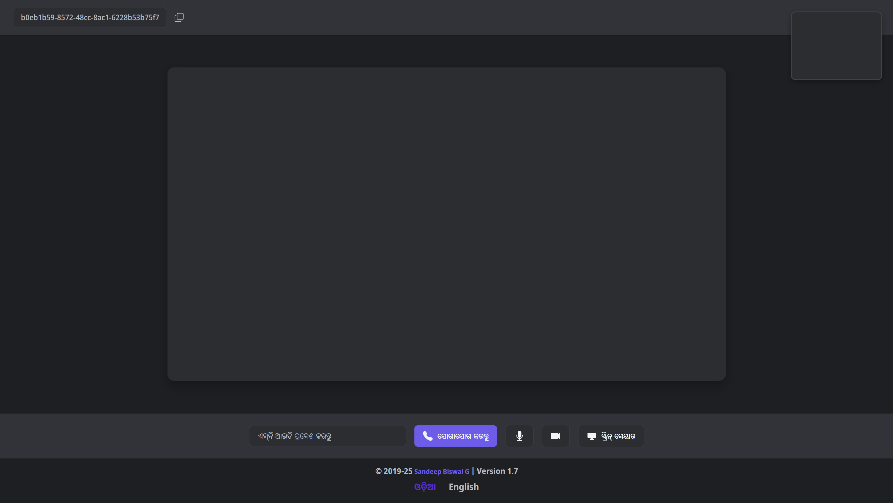
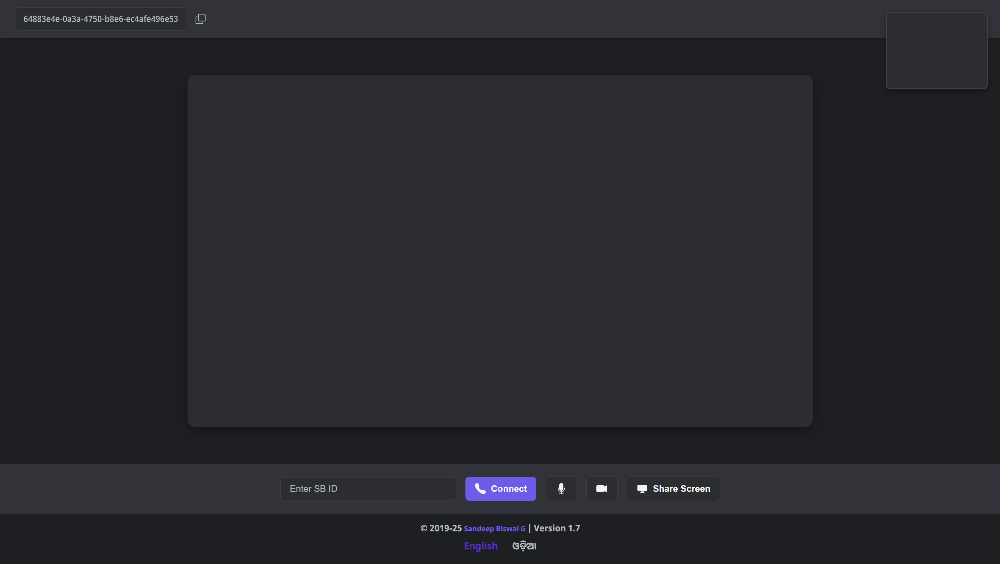

# SB Video Call Web App

Introducing SB Video Call Web App (Peer-to-Peer) – a seamless, secure, and high-quality video calling solution. This app allows users to connect directly with friends, colleagues, or clients, offering crystal-clear video and audio without the need for a centralized server. Enjoy real-time, lag-free communication with no hassle of downloads or installations. Whether for personal chats, business meetings, or virtual hangouts, our app ensures privacy, reliability, and an intuitive user experience. Connect instantly with anyone, anywhere, and make every conversation feel just like face-to-face interaction.
## 🌐 Live Demo

👉 [https://sbcall.netlify.app](https://sbcall.netlify.app)

## 🎯 Features

- 🔗 Peer-to-peer video call using unique SB ID
- 🌐 Language switch support (Odia & English)
- 🎙️ Mute/Unmute microphone
- 📷 Camera On/Off toggle
- 🖥️ Screen Share (PC only)
- 📱 Mobile and Desktop responsive UI
- 🚫 Error handling for invalid/self SB IDs

## 📸 Screenshots

  
  &nbsp;&nbsp;
  

## 🛠️ Tech Stack

- **Frontend**: HTML, CSS
- **AI-generated JavaScript**: via Google AI Studio
- **IDE**: Visual Studio Code
- **Hosting**: Netlify (Free with 100GB bandwidth/month)

## 🚀 How It Works

1. On opening the app, a **Unique SB ID** is generated.
2. Copy this ID and share it with another user.
3. Enter the other user's SB ID in the input box and click **Connect**.
4. Enjoy real-time video calls with mute, camera toggle, and screen share (on PC).

## 🔄 Language Switch

Footer buttons allow switching the UI between:
- **English**
- **ଓଡିଆ (Odia)**

## ⚠️ Note

- Screen Share works only on **desktop browsers** (Chrome recommended).
- Make sure to allow camera and microphone permissions when prompted.

## 📁 Source Code

Feel free to explore or fork this project. If you like it, leave a ⭐!

## 📬 Contact

Created by **Sandeep Biswal G**  
📧 Video: [Watch](https://youtu.be/D27aamAp0Ho)
🎥 YouTube: [Sandeep Biswal G](https://www.youtube.com/@SandeepBiswalG)

---

## 🙏 Support

If you find this project useful:
- ⭐ Star this repository  
- 🛎️ Subscribe to my YouTube channel  
- 💬 Share your feedback!

**Jai Hind**

